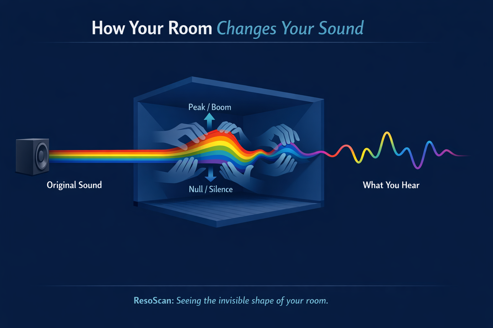

# ResoScan

Measure your room's resonance frequencies — right in your browser.

Plays a sine sweep through your speakers, records it with your microphone, and shows which frequencies your room amplifies or absorbs.

---

### [▶ Try it now — robotaitai.github.io/resoscan](https://robotaitai.github.io/resoscan/)

---

## Explanation

## How to use

1. Open the link above in **Chrome** on a laptop/desktop.
2. Allow microphone access.
3. Pick your input mic and output speakers.
4. Choose a sweep duration (longer = better accuracy).
5. Click **Start measurement** — stay quiet while the sweep plays.
6. View the results: frequency response, impulse response, detected resonances.

**Tips:** Use external speakers, keep the room quiet, and sit where you normally listen. A measurement mic with a calibration file gives the best results.

## Features

- **Log sweep** — 20 Hz to 15 kHz, configurable duration (1 / 3 / 5 / 10 s)
- **Impulse response** — auto-aligned, time-domain plot
- **Frequency response** — log-frequency chart, adjustable window, 1/6 octave smoothing
- **Resonance detection** — top peaks with frequency, prominence, and band classification
- **Mic calibration** — upload a `.txt` / `.cal` / `.csv` correction file
- **Live levels** — RMS & peak meter with clipping warning
- **Device selection** — choose input mic and output speakers
- **Dark mode** — follows system preference

---

[Run locally, scripts, tech →](docs/CONTRIBUTING.md)
